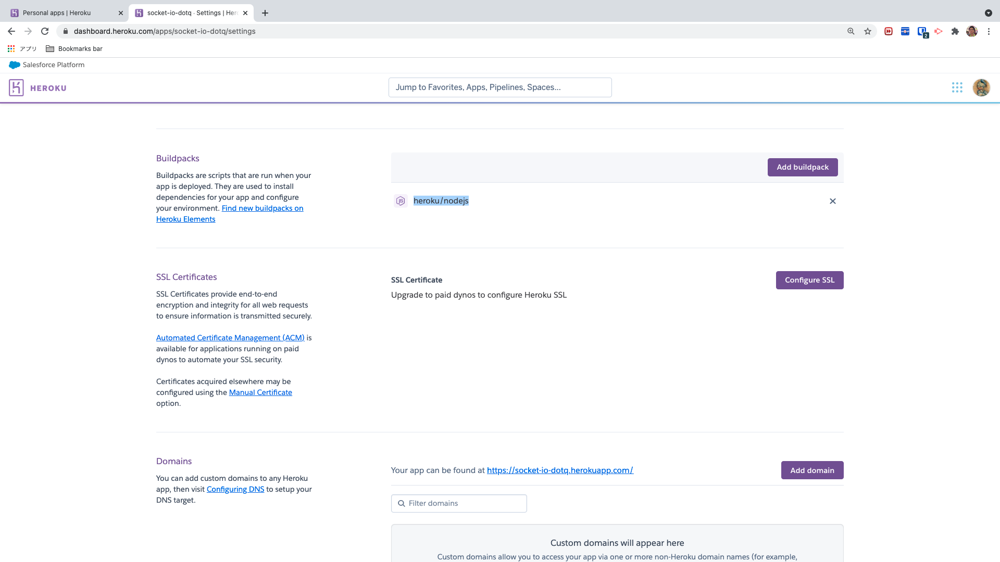

# node-socket-io 🚀

***********

## deploy local
1. `npm i`
2. `nodemon index.js`
3. access "localhost:1234"

## heroku

### deploy
create file "https://github.com/tquangdo/node-socket-io/blob/master/Procfile"
### install
- `npm i -g heroku`
### dashboard on website

***********
### setting
https://github.com/tquangdo/node-zoom-clone-app/blob/master/memo.txt
#### check buildpacks
- `heroku buildpacks -a zoom-clone-app-dotq`
- -> `heroku/nodejs`
- 
